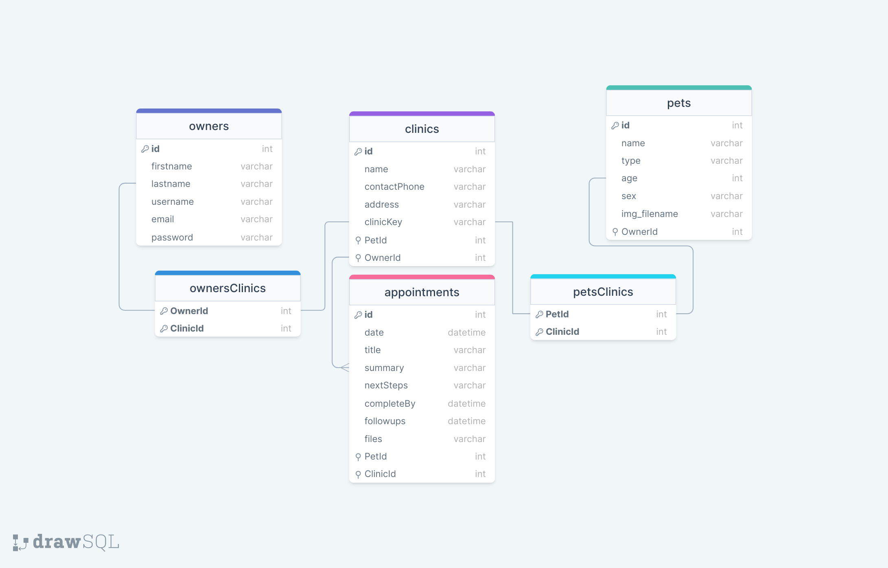

# Set Up:
- Clone this repo from Github
- Run npm install in the main folder
- Cd into the client folder and run npm install again
- Add your .env file to the main folder. Example:
    DB_HOST=localhost
    DB_NAME=petProject
    DB_USER=root
    DB_PASS=root
    SECRET_KEY=""
- Add your .gitignore file

# User Flow:

# Database Schema:

# API End Points:

_This is a student project that was created at [CodeOp](http://codeop.tech), a full stack development bootcamp in Barcelona._
